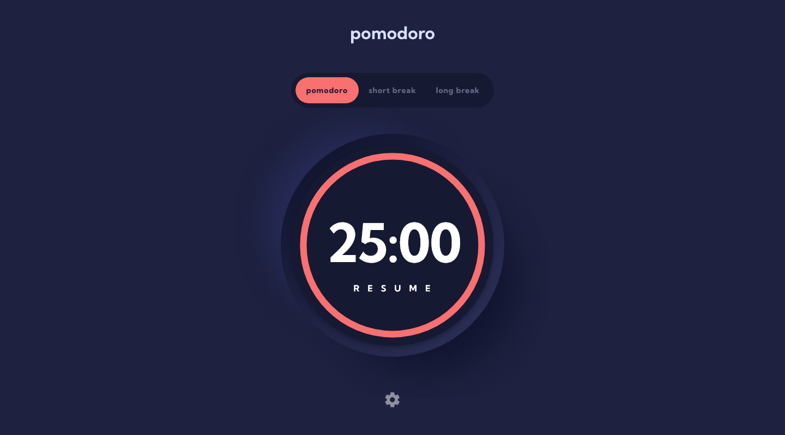
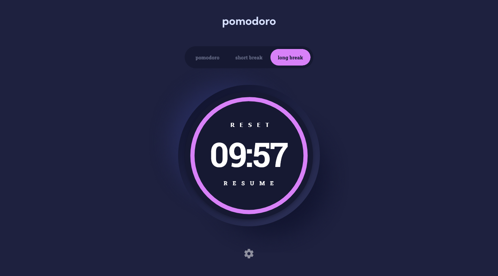
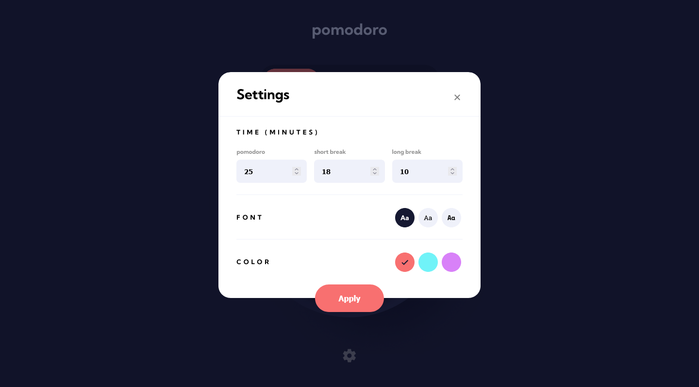

# Frontend Mentor - Pomodoro app solution

This is a solution to the [Pomodoro app challenge on Frontend Mentor](https://www.frontendmentor.io/challenges/pomodoro-app-KBFnycJ6G). Frontend Mentor challenges help you improve your coding skills by building realistic projects.

## Overview

### The challenge

Users should be able to:

- Set a pomodoro timer and short & long break timers
- Customize how long each timer runs for
- See a circular progress bar that updates every minute and represents how far through their timer they are
- Customize the appearance of the app with the ability to set preferences for colors and fonts

## Screenshot

## Links

- [Solution URL](https://www.frontendmentor.io/solutions/pomodoro-app-with-localstorage-support-pBgjGG_eQM)
- [Live site](https://meelix.github.io/frontendmentor-pomodoro-timer/)

## Built with

- Semantic HTML5 markup
- CSS custom properties
- Flexbox
- Css grid
- Mobile-first workflow

## Process

Had a lot of issues geting the script working properly (was a stupid idea to do it without any library). It was also very difficult handeling localStorage with user interactions, reloads, first visit, reset... Other then that the circular progress bar was pretty difficult too until I found [this codepen](https://codepen.io/ahmedhrayyan/pen/GLBELM) which solved all of the issues I had.

Stylewise it's complex but not too difficult.

## Used tools
- [svg to url encoder](https://yoksel.github.io/url-encoder/)
- [icomoon - icon font generator](https://icomoon.io)
- [css grid generator/helper](https://grid.layoutit.com/)